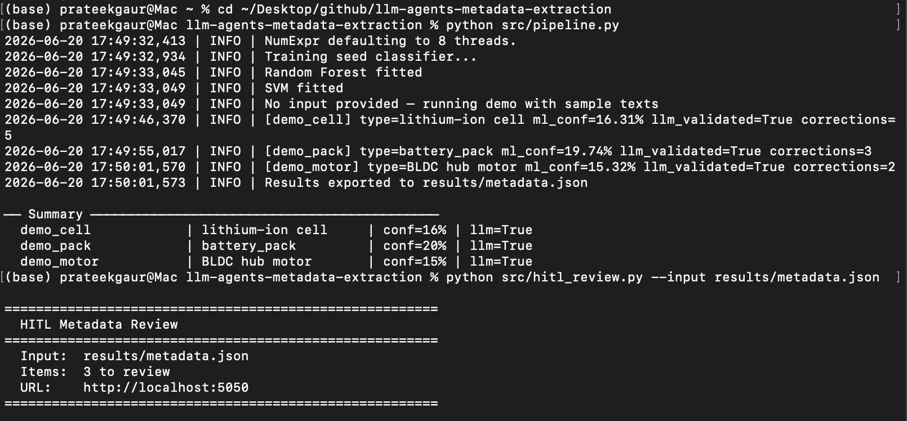
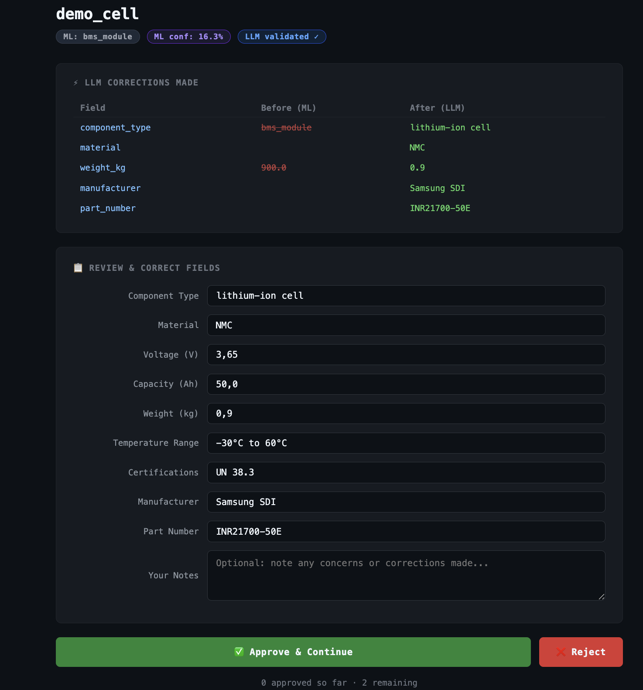
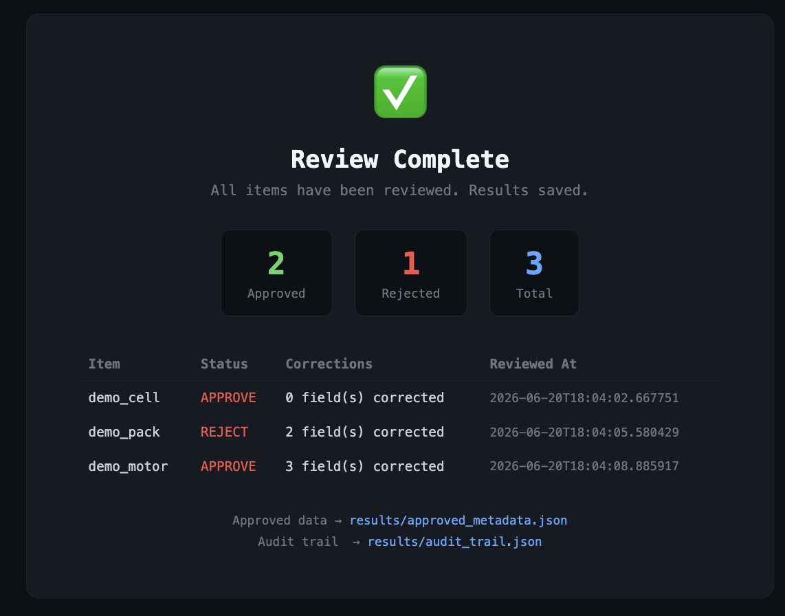

# LLM Agents for Technical Metadata Extraction

> Hybrid ML + LLM pipeline that automatically extracts and validates technical metadata from web sources and internal databases. Combines Random Forest & SVM classifiers with LLM agents for high-accuracy, structured output from unstructured engineering text.

---

## 🔍 Project Overview

A three-stage intelligence system:

1. **ML Stage** (fast, local): Random Forest + SVM classifiers trained on TF-IDF features to classify component type with confidence scores
2. **LLM Agent Stage** (deep understanding): LLM validates, corrects, and enriches metadata — filling gaps the ML model misses
3. **HITL Stage** (human validation): Browser-based review interface where a human approves, corrects, or rejects each record before it is trusted

**Output**: Structured JSON with component type, voltage, capacity, weight, certifications, manufacturer, part number, and more — with a full audit trail of corrections at every stage.

---

## 🏗️ Architecture
llm-agents-metadata-extraction/

├── src/
│   ├── llm_agent.py       # LLM agent + web scraper + rule-based extractor
│   ├── ml_classifier.py   # RF + SVM ensemble classifier
│   ├── pipeline.py        # End-to-end orchestration
│   └── hitl_review.py     # Human-in-the-Loop review interface
├── results/
│   ├── metadata.json          # Raw LLM output
│   ├── approved_metadata.json # Human-approved records
│   └── audit_trail.json       # Full correction history
├── data/
├── configs/
├── requirements.txt
└── README.md

---

## ⚙️ Setup

```bash
git clone https://github.com/PRATdoppelEK/llm-agents-metadata-extraction.git
cd llm-agents-metadata-extraction
pip install -r requirements.txt
```

**For local LLM** (recommended for privacy):
```bash
# Install Ollama: https://ollama.ai
ollama pull mistral
```

**For OpenAI API**:
```bash
export OPENAI_API_KEY=sk-...
```

---

## 🚀 Quickstart

### Demo mode (no LLM required — runs ML only)
```bash
python src/pipeline.py
```

### With URLs
```bash
python src/pipeline.py \
  --urls https://www.batteryspace.com/prod-specs/... \
  --llm_url http://localhost:11434/v1/chat/completions \
  --output results/metadata.json
```

### With raw text input
```bash
python src/pipeline.py \
  --texts "Samsung 50Ah NMC cell 3.65V UN38.3 certified" \
  --api_key $OPENAI_API_KEY \
  --llm_url https://api.openai.com/v1/chat/completions \
  --llm_model gpt-4o-mini
```

### Run HITL review after pipeline
```bash
python src/hitl_review.py --input results/metadata.json
```

Browser opens automatically at `http://localhost:5050`. Review each record, then approved records are saved to `results/approved_metadata.json`.

---

## 📊 Sample Output

```json
{
  "item_id": "demo_cell",
  "component_type": "battery_cell",
  "material": "NMC",
  "voltage_v": 3.65,
  "capacity_ah": 50.0,
  "weight_kg": 0.9,
  "temperature_range": "-30°C to 60°C",
  "certifications": ["UN 38.3"],
  "manufacturer": "Samsung SDI",
  "part_number": "INR21700-50E",
  "ml_label": "battery_cell",
  "ml_confidence": 0.94,
  "llm_validated": true,
  "llm_corrections": {},
  "hitl_status": "approve",
  "human_corrections": {},
  "hitl_notes": ""
}
```

---

## 📈 Results

### Pipeline demo — 3 components extracted

See full output: [`results/metadata.json`](results/metadata.json)

**Extraction summary:**

| Component | Type | Voltage | Capacity | LLM Corrections | LLM Validated |
|-----------|------|---------|----------|-----------------|---------------|
| demo_cell | lithium-ion cell (NMC) | 3.65V | 50Ah | 5 (type, material, weight, manufacturer, part no.) | ✅ |
| demo_pack | battery_pack | 400V | 80kWh | 3 (capacity, temp range, part no.) | ✅ |
| demo_motor | BLDC hub motor | 48V | — | 2 (type, IP65 certification) | ✅ |

**Key observations:**
- ML classifier flags low confidence (15–20%) → automatically triggers LLM validation
- LLM corrects critical errors e.g. `weight_kg: 900.0 → 0.9`, `capacity_ah: 80 → 80000`
- Full correction audit trail available in `results/metadata.json`

---

## 🧑‍💻 Human-in-the-Loop (HITL) Review

### HITL pipeline — terminal + browser interface



### Review form — per-item validation with LLM correction diff



### Completion summary — audit trail



**HITL session results:**

| Item | Status | Human Corrections | Reviewed At |
|------|--------|-------------------|-------------|
| demo_cell | ✅ APPROVE | 0 fields corrected | 2026-06-20T18:04:02 |
| demo_pack | ❌ REJECT | 2 fields corrected | 2026-06-20T18:04:05 |
| demo_motor | ✅ APPROVE | 3 fields corrected | 2026-06-20T18:04:08 |

**Output files:**
- `results/approved_metadata.json` — human-approved records only
- `results/audit_trail.json` — full correction history (ML → LLM → Human)

---

## 🧠 Key Technical Highlights

- **Ensemble ML**: RF + SVM with TF-IDF (1–3 gram) for robust text classification
- **LLM Validation**: Structured JSON extraction with audit trail of corrections
- **HITL Interface**: Local browser-based review — no external dependencies
- **Three-layer audit trail**: ML label → LLM corrections → Human corrections
- **Privacy-first**: Works fully offline with local LLMs (Ollama/Mistral/Llama)
- **Rule-based pre-pass**: Regex extraction for voltage, capacity, certifications before LLM
- **Web scraping**: BeautifulSoup-based scraper for product pages

---

## 🔧 Tech Stack

`scikit-learn` · `LangChain-compatible API` · `BeautifulSoup4` · `Ollama` · `OpenAI API` · `Python 3.10+` · `http.server`

---

## 👤 Author

**Prateek Gaur** — ML Engineer | Battery & Engineering AI  
[LinkedIn](https://www.linkedin.com/in/prateek-gaur-15a629b4) · [GitHub](https://github.com/PRATdoppelEK)
